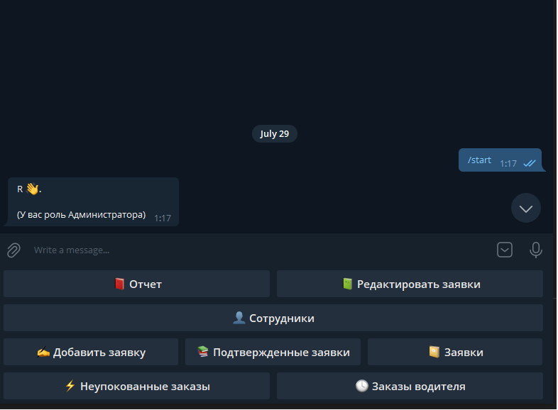
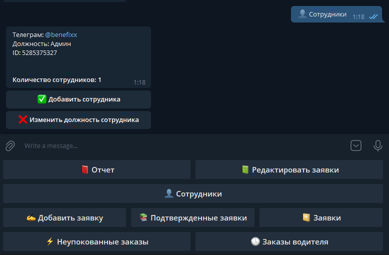
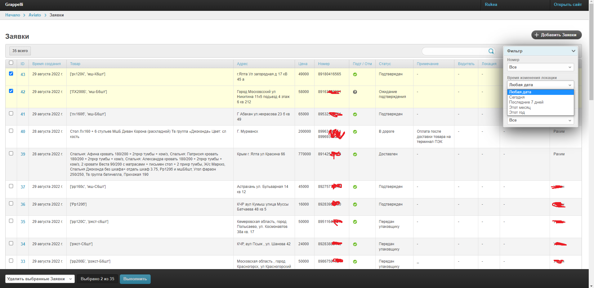

# Summary

Date : 2022-08-28 17:22:04

Directory c:\\Users\\User\\Desktop\\django-aiogram-bot

Total : 526 files,  96926 codes, 14661 comments, 22587 blanks, all 134174 lines

Summary / [Details](details.md) / [Diff Summary](diff.md) / [Diff Details](diff-details.md)

## Languages
| language | files | code | comment | blank | total |
| :--- | ---: | ---: | ---: | ---: | ---: |
| Python | 49 | 3,719 | 157 | 886 | 4,762 |
| JSON | 1 | 72 | 0 | 1 | 73 |
| Markdown | 3 | 44 | 0 | 14 | 58 |
| pip requirements | 1 | 6 | 0 | 0 | 6 |
#

## Часть скринов проекта

***
## Запуск бота и web админки
* ### python manage.py runserver
* ### python manage.py bot

* celery -A app worker -l info
* celery -A app beat -l info
